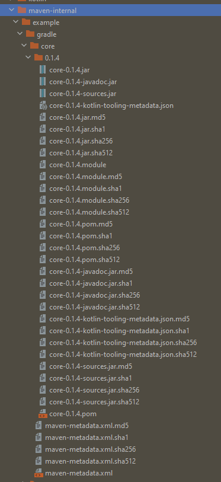
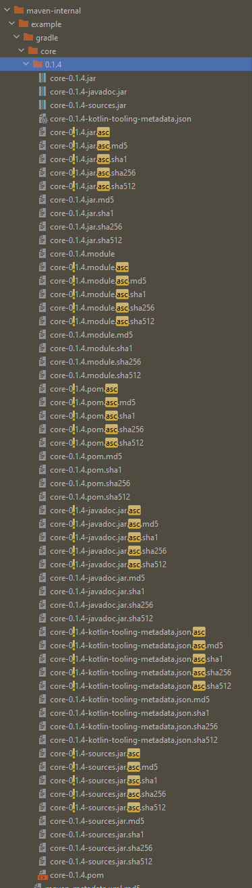

https://github.com/gradle/gradle/issues/20934

1. set properties in `$GRADLE_USER_HOME/gradle.properties`
    ```properties
    signing.keyId=...
    signing.password=...
    signing.secretKeyRingFile=C:/Users/Name/.gnupg/<...>.private.pgp
    signing.key=<base64 encoded secret key, all on one line>
    
    
    signing.gnupg.keyName=...
    signing.gnupg.executable=D:/Users/Name/scoop/apps/gpg/current/bin/gpg.exe
    signing.gnupg.useLegacyGpg=true
    ```
2. Run `./gradlew publish`
3. Check the files in [`./build/maven-internal`](./build/maven-internal)

   There are no `*.asc` signature files
   
   
4. Re-run `./gradlew publish`
5. There are now `*.asc` files in [`./build/maven-internal`](./build/maven-internal)

   
   
6. Annoyingly all `*.asc` files have checksum
   files [#20232](https://github.com/gradle/gradle/issues/20232), even though they're not required
   by Sonatype
   > [Notice that .asc files don't need any additional checksum file, nor checksum files don't need
   .asc signature file.](https://central.sonatype.org/publish/requirements/#provide-files-checksums)


### Other errors

When re-running `./gradlew publish`

```none
Could not load the value of field `properties` of `org.apache.maven.model.Developer` 
bean found in field `developers` of `org.apache.maven.model.Model` bean found in field 
`model` of `org.gradle.api.publish.maven.internal.tasks.MavenPomFileGenerator$MavenPomSpec` 
bean found in field `value` of `org.gradle.internal.Try$Success` bean found in field `result` of 
`org.gradle.internal.serialization.Cached$Fixed` bean found in field `mavenPomSpec` of task 
`:modules:core:generatePomFileForJsPublication` of type 
`org.gradle.api.publish.maven.tasks.GenerateMavenPom`.
> java.lang.reflect.InvocationTargetException (no error message)
```
